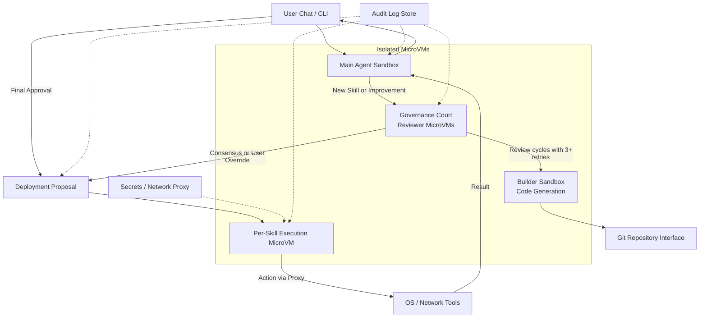

# Product Requirements Document (PRD) – AegisClaw

**Secure-by-Design Local Agent Platform**

> Your personal agent you can trust like a paranoid enterprise.

## 1. Title, Version, Revision History & Approvals

**Document Title**  
Product Requirements Document (PRD) – AegisClaw v2.0 – Secure-by-Design, Local-First, Self-Evolving AI Agent Platform for Linux

**Approvals / RACI (Roles only – names to be added as team grows)**

| Role                        | Responsibility                          | RACI     |
|-----------------------------|-----------------------------------------|----------|
| Product Owner               | Overall vision, priorities, user needs  | Responsible / Accountable |
| Security Architect          | Threat model, isolation, secrets, audit | Responsible / Consulted   |
| CISO-equivalent Reviewer    | Governance Court policy, risk acceptance| Accountable / Consulted   |
| Core Engineer(s)            | Implementation, SDLC enforcement        | Responsible               |
| User Advocate / Tester      | Persona validation, UX flows            | Consulted                 |

Approvals will be captured via GitHub PR reviews and signed commits as the project matures.

## 2. Executive Summary / Product Overview

AegisClaw is a **paranoid-by-design**, local-first, self-evolving AI agent platform that runs exclusively on Linux with Ollama. It lets security-conscious users add powerful skills (Slack, GitHub, shell, file operations, etc.) through a rigorous, enterprise-grade SDLC enforced by an internal **Governance Court** of isolated LLM personas.

Unlike existing agents that expose broad privileges or rely on cloud services, AegisClaw treats every skill as a potential threat. Skills run in per-skill microVMs with read-only filesystems, dropped capabilities, private Docker daemons, and runtime secret injection via a network proxy — API keys **never** appear in prompts, code, logs, or LLM context. Antagonistic or malicious skills are made structurally impossible.

**Key Differentiators**
- Mature security, practices, and risk management built in from day one (not bolted on).
- Your own team of enterprise experts (Coder, Tester, CISO, Security Architect, User Advocate) for sage advice and multi-persona reviews — each reviewer runs in its own isolated microVM.
- Stay local by default, go global when you choose: use Ollama-only today, with pluggable support for models and data exposure appropriate for your risk profile tomorrow.
- Full self-improvement: the system can propose and apply its own patches via the Court.
- Everything is git-backed, auditable via an append-only Merkle-tree log, and reversible.

Target users range from hobbyist Linux admins to startups and enterprises who want an agent they can actually trust with real desktop and infrastructure actions.

## 3. Problem Statement & Opportunity

Today’s desktop and infrastructure agents suffer from critical gaps that make them unsuitable for anything beyond low-risk experimentation:

- **Credential leaks and secret exposure** — keys often end up in prompts, logs, or shared memory.
- Lack of **mature software engineering and risk-management practices** — most agents allow arbitrary code execution with minimal review or isolation.
- No governance for skill addition — anyone (or any prompt injection) can introduce dangerous capabilities.
- Non-reversible or hard-to-audit actions.
- Heavy cloud dependency or opaque supply chains.
- Poor scalability across user maturity levels (hobbyist → enterprise compliance needs).

Competitors highlight these issues:
- **OpenClaw** provides a flexible multi-platform personal assistant with broad messaging and tool support, but relies on a gateway model that inherits significant privilege and lacks the enforced multi-persona SDLC or per-skill microVM isolation AegisClaw mandates.
- **Sympozium** offers strong Kubernetes-native fleet orchestration with sandboxed sidecars and policy-as-CRD, but targets cluster-scale workloads rather than a lightweight, local-first Linux desktop agent with built-in paranoid review processes.

**Opportunity**  
In 2026–2028 there is strong demand for a truly trustworthy local agent across three segments that share the same Linux + Ollama foundation but have different risk postures:
- **Hobbyists / researchers** — want quick onboarding and powerful tools without trusting cloud providers.
- **Startups / small companies** — need speed plus basic audit trails for future compliance.
- **Enterprises** — demand pre-action visibility, custom policies, expert personas, and full auditability for regulatory reviews.

AegisClaw’s design intentionally scales across these audiences: the same core isolation and Court mechanisms serve all three, with configurable strictness levels (suggested by user profile at onboarding and changeable later via Court-reviewed proposals).

## 4. Vision, Mission & Strategic Goals

**Mission**  
Safe self-hosted, self-improving agents for an abundant future.

**Vision**
- **1-month horizon**: Reach self-hosting maturity where AegisClaw can open and review its own GitHub PRs using the Governance Court.
- **2-month horizon**: Friends and early testers are running it, providing feedback that the Court itself helps incorporate.
- **1-year (audacious) horizon**: AegisClaw gains measurable market share over broader agents like OpenClaw by being the clearly safer and more trustworthy choice for users who value real work over convenience.

**Strategic Goals** (measurable)
1. Zero isolation violations in any internal or external red-team exercises by public v1.0 release.
2. Every skill-addition workflow completes end-to-end in <15 minutes of user time (average).
3. The system successfully proposes and merges at least one self-improvement patch via the Court within the first month of self-hosting.
4. Support at least 10 production-grade skills with full audit trails and reversible actions.
5. Onboarding + first skill for a new hobbyist user takes <10 minutes.
6. Enterprise mode allows full customization of reviewer personas, policies, and approval flows while preserving the immutable isolation guarantees.
7. 98%+ structured JSON success rate with schema validation across all Court interactions.
8. Append-only Merkle-tree audit log covers 100% of proposals, reviews, code changes, and deployments.

## 5. Target Users, Personas & User Journeys

### Primary Personas

**Alex Rivera – Hobbyist / Security-Conscious Linux Admin**  
- Comfortable with Ubuntu, comfortable using terminal and Docker.  
- Wants to get started quickly, add useful tools (Slack, GitHub, shell helpers), and have the agent help improve both the agent itself and their own workflows.  
- Daily workflow: texts or talks to the agent(s) multiple times per day.  
- Success: Powerful capabilities without ever worrying about credential leaks or accidental damage.

**Startup Engineer / Founder**  
- Needs the agent to accelerate work “ASAP” while still producing auditable records.  
- Trusts the system to make good decisions but wants clear “why” logs in case a compliance body or investor ever asks.  
- Same daily chat-heavy interaction pattern; values speed + reversible actions.

**Enterprise DevOps / Security Engineer**  
- Runs Ubuntu in production environments.  
- Requires visibility into why decisions are made **before** actions occur (especially for compliance audit readiness).  
- Can set custom policies, expert reviewer personas, and tailored SDLC process flows.  
- Expects the same rock-solid isolation guarantees regardless of customization.

Additional enterprise job-function personas (to be expanded as needed): Platform Engineer, Compliance Officer, SRE, Internal Tools Developer.

### Suggested Configuration Trade-offs
At onboarding (and via later Court-reviewed proposals), the system will suggest strictness/speed profiles based on the detected or declared user type. Users can always adjust (with human review required for relaxing controls).

### Key User Journeys (to be detailed in Section 6)
1. First-time installation and onboarding.
2. Adding the first skill (e.g., Slack messaging) via the full Court process.
3. Daily operation of existing skills (chat → action → response).
4. Requesting a self-improvement patch or new capability.
5. Reviewing audit logs / “why” explanations (especially important for startup & enterprise).
6. Incident response or skill revocation.
7. Customizing policies / reviewer personas (enterprise).

## 6. Key Features, Functional Requirements & User Stories

All functional requirements are derived from the core vision of a paranoid-by-design agent. Features are grouped into epics with traceable IDs.

### Epic FR-001: Skill Management & Governance Court
**Description**: Users add, extend, review, and revoke skills through a rigorous, multi-persona SDLC enforced by the Governance Court.

**User Story FR-001.1 – Add a New Skill (Slack example expanded)**
- As a user, I want to request “Add a tool to send messages to Slack” so I can integrate real communication without compromising security.
- **Detailed Flow** (refined from v1.0):
  1. User sends natural-language request to the main agent sandbox.
  2. Main agent interactively refines via questions (business need, authentication method, rate limits, potential risks, success criteria).
  3. Refined proposal generated as structured JSON and stored in git.
  4. Governance Court spins up isolated reviewer microVMs with personas: Coder, Tester, CISO, Security Architect, User Advocate.
  5. CISO persona enforces network policy, secret proxy configuration, and updates the threat model.
  6. Code is generated/edited inside a clean builder sandbox → git commit + simulated PR.
  7. Reviewers iterate (approve / reject / ask clarifying questions) until consensus or explicit user override (with audit trail).
  8. Build and test occur in a disposable sandbox; artifacts are signed.
  9. Deployment proposal (Docker/Podman compose update or equivalent) is presented for final user vote.
  10. Upon approval, the skill activates in its own isolated microVM and becomes immediately usable.
- **Acceptance Criteria**:
  - All steps are fully git-backed and reversible (snapshots + git revert).
  - Average user time for end-to-end skill addition < 15 minutes.
  - 98%+ structured JSON success rate with schema validation on all Court outputs.
  - Every proposal, review comment, code change, and deployment is recorded in the append-only Merkle-tree audit log.

**User Story FR-001.2 – Skill Revocation & Reversion**
- As a user, I can revoke any skill instantly; the system performs a clean shutdown, removes the microVM, and reverts related git changes.

**User Story FR-001.3 – Self-Improvement Proposals**
- As the system, I can propose patches or new capabilities to myself; these flow through the same Court process (with mandatory human final approval).

### Epic FR-002: Core Agent Operation
**Description**: Daily interaction with existing skills.

**User Story FR-002.1 – Execute Authorized Actions**
- As a user, I chat with the agent (text or voice) → agent routes to appropriate skill microVM → action executes under least-privilege rules → result returned.
- High-risk actions (shell exec with write, file deletion, network outbound beyond allow-list) require explicit human confirmation.

**User Story FR-002.2 – Explain Decisions**
- As a startup or enterprise user, I can request “why” explanations for any past or proposed action, pulling from the audit log with clear reasoning traces.

### Epic FR-003: Configuration & Customization
**User Story FR-003.1 – User Profile & Strictness Levels**
- At onboarding and via Court-reviewed proposals, the system suggests strictness/speed profiles based on declared user type (hobbyist, startup, enterprise). Users can adjust later (relaxing controls requires human + CISO-level review).

**User Story FR-003.2 – Custom Policies & Personas (Enterprise)**
- Enterprise users can define custom reviewer personas, approval policies, and process flows while the core isolation guarantees remain immutable.

**Functional Requirements Summary (Non-Exhaustive)**
- All inter-component communication uses structured JSON with strict schema validation.
- Capability-based permissions: each skill receives only the exact OS/network/file capabilities it needs.
- Sandbox backend: **Firecracker microVMs** (initial implementation). Docker-based sandboxes only after mature Linux support and thorough red-teaming.
- Support for multiple concurrent skills with resource isolation.

## 7. Out-of-Scope / Non-Goals / Explicit Boundaries

To maintain focus and security invariants, the following are explicitly out of scope (and protected against accidental regression):

- **Never-allowed actions**:
  - Financial transactions of any kind.
  - Deletion or modification of user data without explicit, logged confirmation and backup.
  - Execution of unsigned or un-reviewed code outside the Court process.
  - Direct exposure of any secrets to LLM context, prompts, or logs.

- **Platform support**: Linux-only (with Ubuntu focus) at first, Windows or macOS in the future (alongside the switch to Docker Sandboxes when Linux support lands).
- **Cloud LLM fallback** by default (Ollama-only; optional pluggable support must preserve local-first guarantees and go through Court review).
- **Multi-user concurrent sessions** on a single host without separate isolation boundaries (future consideration).
- **High-availability / clustered deployment** (Sympozium-style Kubernetes fleet orchestration is complementary, not core).

**Immutable Design Rules** (“DO NOT CHANGE”):
- Per-skill microVM isolation must always enforce read-only filesystem (except explicit writable workspace), `cap-drop ALL`, private Docker daemon, and no shared memory between skills or with the host.
- Secrets handling must never place keys in LLM prompts, generated code, or persistent logs.

Any proposal that would violate these rules must be automatically rejected by the CISO persona with a logged explanation.

## 8. Non-Functional Requirements

### Security & Privacy (Elevated from v1.0)
- **Isolation**: Firecracker microVMs (initial implementation) providing strong hardware-level isolation. Docker-based sandboxes will be adopted later only after thorough validation and Governance Court approval. Requirements remain: read-only FS (except designated workspace), `cap-drop ALL`, no shared memory, network egress restricted by per-skill allow-list + proxy.
- **Secrets Management**: Injected at runtime only via dedicated network proxy (or SOPS/age with ephemeral mount). Keys never appear in prompts, code, logs, LLM context, or git history.
- **LLM Trust**: Ollama-only. Default ensemble: Llama-3.2-3B (fast reviewers), Mistral-Nemo (reasoning), Phi-3 (small audited). All model downloads hash-verified. Court outputs cross-verified by ≥2 models. No cloud APIs by default.
- **Audit & Tamper-Evidence**: Append-only Merkle-tree log covering every proposal, review, git change, deployment, and runtime action. Tamper-evident; queryable for “why” explanations.
- **Prompt Injection & Adversarial Defense**: All inputs sanitized; structured output enforcement; guardrail checks before high-risk tool calls.

### Performance & Reliability
- Baseline resource usage: <4 GB RAM for core system + sequential low-resource mode.
- Agent response time: <2 seconds (95th percentile) for simple queries; <15 minutes user time for full skill addition.
- Structured JSON parsing success rate: ≥98% with schema validation on all Court and tool outputs.
- Reliability: All mutations reversible; graceful degradation if a reviewer microVM fails (fallback to user escalation).

### Extensibility & Maintainability
- New reviewer personas configurable via Court-approved changes.
- Signed artifacts for all builds and deployments.
- Reproducible builds where feasible.

### Scalability Across User Types
- Hobbyists: Fast onboarding, default permissive-but-safe profile.
- Startups: Balanced speed with audit trails.
- Enterprises: Full customization of policies and personas while preserving core isolation invariants.

**Success Metrics**
- Zero isolation violations in any red-team tests (internal or external).
- Every skill addition completes end-to-end in <15 min (user time).
- Self-improvement: system successfully proposes and merges at least one patch via the Court.
- 100% of actions and reviews covered by the append-only audit log.
- Support for at least 10 production-grade skills with full reversibility and auditability by v1.0 public release.

## 9. Security & Privacy Requirements

Security is the foundational differentiator of AegisClaw. Every design decision prioritizes **secure-by-design** principles over convenience, treating the agent as a high-risk system from day one. This section formalizes the threat model, mitigations, and compliance path.

### 9.1 Threat Model (STRIDE)

We apply the **STRIDE** framework (Spoofing, Tampering, Repudiation, Information Disclosure, Denial of Service, Elevation of Privilege) to core components. Threats are rated by potential impact (High/Medium) in the context of a local Linux desktop agent with real OS actions.

**Key Components Analyzed**:
- MicroVM Coordinator Daemon + CLI ("Kernel")
- Main Agent Sandbox
- Governance Court Reviewer MicroVMs
- Builder Sandbox
- Per-Skill Execution MicroVMs
- Secrets/Network Proxy
- Git Repository Interface
- Audit Log Store
- Ollama Server

**STRIDE Threat Summary Table** (excerpt; full details in `docs/threat-model.md`):

| Threat Category       | Example Threat                                                                 | Affected Components                          | Impact | Primary Mitigations |
|-----------------------|-------------------------------------------------------------------------------|----------------------------------------------|--------|---------------------|
| **Spoofing**         | Malicious reviewer persona or fake Court approval                             | Court Reviewers, CLI                         | High   | Isolated microVMs, signed JSON outputs, multi-reviewer consensus |
| **Tampering**        | Prompt injection altering skill code or tool behavior                        | Main Agent, Per-Skill MicroVMs, Web tools    | High   | Structured JSON + schema validation, 3-reviewer retries, input sanitization |
| **Repudiation**      | Untraceable malicious action or self-modification                             | All actions, Git changes                     | High   | Append-only Merkle-tree audit log, signed commits/artifacts |
| **Information Disclosure** | Credential leak via prompt, log, or side-channel                             | Secrets Proxy, LLM context                   | High   | Runtime injection only via proxy; never in prompts/code/logs; no shared memory |
| **Denial of Service**| Resource exhaustion from infinite loops or malicious skill                   | Per-Skill MicroVMs, Coordinator              | Medium | Resource limits, timeouts, private daemon per sandbox |
| **Elevation of Privilege** | Skill escaping microVM or updating kernel directly                          | Per-Skill MicroVMs, Kernel                   | High   | `cap-drop ALL`, read-only FS (except workspace), immutable kernel updates only via Court-approved PRs to the main project (agent cannot self-update kernel) |

**Additional Agentic-Specific Threats (OWASP Top 10 for Agentic Applications 2026 – primary framework)**:
- **ASI01: Agent Goal Hijack** — Mitigated by interactive refinement, structured proposals, and CISO persona veto.
- **ASI02: Tool Misuse & Exploitation** — Guardrails before high-risk calls; per-skill allow-lists; explicit human confirmation for write/network actions.
- **ASI03: Identity & Privilege Abuse** — Capability-based tokens; least-privilege per skill.
- **ASI04: Agentic Supply Chain Vulnerabilities** — Hash-verified Ollama models; signed artifacts; reproducible builds with BOM/provenance.
- **ASI05: Unexpected Code Execution** — All code generation occurs in builder sandbox; reviewed before deployment.
- **Prompt Injection into Tools** (e.g., adversarial websites via web crawler) — Sanitized inputs, output validation, isolated execution.

**Secondary: OWASP Top 10 for LLM Applications** (e.g., Prompt Injection, Insecure Output Handling, Excessive Agency, Supply Chain) addressed via structured outputs, guardrails, and ensemble verification.

**Residual Risk Statement**  
Certain non-determinism in LLM outputs is accepted but strictly bounded by structured JSON schemas, multi-reviewer retries (minimum 3 attempts per reviewer for consistency), cross-verification, and human final approval for high-risk changes. Isolation violations or kernel-level changes outside the Court process are treated as catastrophic and must trigger immediate abort + alert.

### 9.2 Secrets & Data Protection
- Secrets provided only via CLI → injected at runtime through a dedicated network proxy (running in its own microVM where feasible).
- Never stored in prompts, generated code, logs, git, or LLM context.
- Support for SOPS/age as fallback with ephemeral mounts.
- All persistent storage (git, audit log) encrypted at rest where possible.

### 9.3 Compliance Path
- **Immediate focus**: Functionality + core security invariants to prove the model.
- **Phase 1 (post-MVP)**: GDPR/CCPA basics (data minimization, consent for audit logs, right to explanation via "why" queries).
- **Phase 2**: SOC 2 Type 1 readiness (controls for security, availability, processing integrity; audit logging, change management via Court).
- **Later**: SOC 2 Type 2 and ISO 27001 as enterprise needs arise.

Human-in-the-loop required for all high-risk actions and policy relaxations.

**Acceptance Criteria**:
- Zero successful isolation escapes in red-team exercises.
- 100% of secrets handled via proxy (verified in automated tests).
- All Court decisions require ≥3 consistent outputs per reviewer.

## 10. Architecture & Design Principles

### 10.1 Core Design Principles
- **Zero-Trust**: No component trusts another by default; all communication uses validated JSON schemas and capability tokens.
- **Local-First by Default**: Ollama-only for all core operations. Any optional cloud LLM support requires explicit human approval plus full Governance Court review and advisement. Isolation must be strictly preserved (e.g., dedicated microVM per cloud caller with no shared memory or context, per-skill network proxy enforcement, and capability tokens limiting data exposure). Cloud usage must never weaken the immutable isolation guarantees outlined in Section 7.
- **Reproducible & Provable Builds**: Signed artifacts, Software Bill of Materials (SBOM), build provenance.
- **Capability-Based Security**: Each skill receives only the exact OS/network/file capabilities needed (fine-grained tokens).
- **Immutable & Consistent Core**: Sandboxing is intentionally non-pluggable in early versions to enforce uniform, verifiable isolation guarantees. Initial implementation uses **Firecracker microVMs**. Transition to Docker-based sandboxes will occur only after full Linux sandbox support is available, thoroughly red-teamed, and approved via the Governance Court. All kernel, client, and sandbox updates must go through Court-approved PRs to the main AegisClaw project — the agent cannot directly update the kernel, itself, or the sandboxing layer outside this controlled process.
- **Paranoid Pragmatism**: Favor explicit human oversight and auditability over full autonomy for sensitive operations.

### 10.2 High-Level Components
- **MicroVM Coordinator Daemon + CLI** ("Kernel"): Manages lifecycle of all microVMs; requires root on host. CLI is the sole user entrypoint for secrets and commands. (Future: replaceable by Docker when full sandbox support lands.)
- **Ollama Server/Endpoint**: Local model serving (default ensemble: Llama-3.2-3B for speed, Mistral-Nemo for reasoning, Phi-3 for small/audited tasks).
- **Main Agent Sandbox**: Orchestrates user interactions and routes to skills.
- **Governance Court Reviewer MicroVMs**: Isolated per-review; personas (Coder, Tester, CISO, Security Architect, User Advocate); each performs ≥3 retries for output consistency.
- **Builder Sandbox**: Ephemeral microVM spun up per build; clean environment for code generation/editing.
- **Per-Skill Execution MicroVMs**: Isolated runtime for each skill (read-only FS except workspace, `cap-drop ALL`, private daemon).
- **Secrets/Network Proxy**: Dedicated component for runtime secret injection and egress control.
- **Network Firewall**: Enforces per-skill allow-lists (falls back to host-level rules if microVM config insufficient).
- **Git Repository Interface**: Handles all git operations (mirrored to user disk).
- **Audit Log Store**: Append-only Merkle-tree; tamper-evident writes to user disk.
- **Optional (Enterprise)**: Persona/Policy Store — deferred to avoid early complexity; can be added as Court-approved extension.

#### 10.3 Data Flow (Mermaid Diagram)

**Key Cycles**:
- Review loops in Court until consensus or user override (with audit trail).
- Self-improvement proposals follow the same path.
- Error paths: Reviewer failure → escalate to user; isolation check fail → abort; high-risk action → explicit confirmation.

### 10.4 Fallback & Degradation
- Ollama/reviewer unavailable → graceful degradation to user escalation with clear explanation.
- Isolation or policy violation → immediate abort + alert in audit log.
- Common error scenarios (e.g., inconsistent LLM outputs, network denial) logged and surfaced with "why" traces.

**Acceptance Criteria**:
- All inter-component calls use validated schemas.
- Builds produce SBOM + signed provenance.
- Zero-trust enforced: no implicit trust between sandboxes.

**References**: See `docs/architecture.md` (detailed component specs), `docs/schemas/` (JSON schemas), and `docs/threat-model.md` for expanded STRIDE tables.

## 11. SDLC, Governance & Release Process

The AegisClaw SDLC is designed to mirror mature risk-measuring company practices while remaining practical for hobbyist and startup users. The **Governance Court** serves as the living team of enterprise experts that weighs in at every needed stage — from ideation and requirements refinement through code implementation, pre-deployment gates, and ongoing operations.

The default process is deliberately strong and detailed to enforce security invariants from day one. Enterprise users can configure lighter or stricter flows via Court-approved policies, but core isolation guarantees (Section 7) remain immutable and are automatically enforced.

### 11.1 Overall SDLC Flow
The lifecycle consists of these stages, with the Governance Court participating as needed:

1. **Ideation & Refinement** — User or system proposes a change (new skill, improvement, policy). Main agent interactively refines requirements with the user. Court personas (especially User Advocate and CISO) provide early feedback to strengthen the proposal.
2. **Threat Model / STRIDE Review** — Mandatory before any significant code generation or design changes (see Section 9).
3. **Design & Planning** — Detailed user stories, JSON schemas, and capability requirements are produced.
4. **Implementation** — Code generation and editing occur inside the ephemeral Builder Sandbox. Court personas (Coder, Security Architect) perform code reviews via simulated PRs.
5. **Automated Security Gates** — Executed in the Builder Sandbox and CI pipeline.
6. **Court Consensus & Final Review** — Full multi-persona review with ≥3 retries per reviewer for consistency.
7. **Build & Test** — In disposable sandboxes.
8. **Deployment & Activation** — Signed artifacts only; user final approval for high-impact changes.
9. **Operations & Monitoring** — Runtime observation, periodic BOM/CVE checks, anomaly detection. Court can be invoked for ongoing reviews.

**Mediator Persona**: Spins up automatically on detected deadlocks or prolonged disagreement. It attempts resolution using the user’s saved profile/preferences and provides advice. If unresolved, escalates to explicit user decision with full context.

### 11.2 Mandatory Security Gates (Default – Strong)
The following mature practices are enforced by default (via CISO and Security Architect personas + automated tools). Enterprise policies may adjust timing or strictness but cannot disable core invariants.

- **Threat Model / STRIDE Review** before any significant code generation or design changes.
- **SAST** (e.g., Semgrep or CodeQL) and **SCA** (Software Composition Analysis) in the builder sandbox and CI pipeline.
- **Signed commits** and **signed build artifacts** (GPG or Sigstore) — especially critical for Firecracker `rootfs.ext4` images and `vmconfig.json` files.
- **Policy-as-Code** enforcement (e.g., Open Policy Agent / Rego rules) to automatically validate isolation invariants: read-only filesystem (except workspace), `cap-drop ALL`, network egress allow-lists, secret proxy usage.
- **Reproducible builds** with **SBOM** (Software Bill of Materials) and build provenance for all rootfs images and skill artifacts.
- **Versioned prompts and schemas** for all Governance Court reviewer personas to improve consistency and auditability.
- **Secrets scanning** in CI to prevent accidental leakage.
- **Automated adversarial testing** (prompt injection suites, tool misuse simulations) as part of the pre-deployment gate.

**Primary Build Artifact (Firecracker mode)**: A signed, read-only `rootfs.ext4` image plus the generated `vmconfig.json`. The MicroVM Coordinator Daemon **must** verify signatures and hashes before launching any microVM.

For early hobbyist/startup phases, begin with a minimal viable set of these gates and progressively strengthen them toward SOC 2 Type 1 readiness. The Court itself enforces many checks through its personas.

### 11.3 Release & Rollback Process
- All deployments use versioned, signed microVM configurations (common kernel across microVMs, but signed/hashed filesystems and `vmconfig.json` per version).
- A compose-equivalent manifest tracks the combination of microVM versions, enabling simple rollback by reverting to a previous manifest version.
- Self-improvement patches or core updates are proposed by the system, flow through the full Court process, and result in GitHub PRs (with mandatory human final approval).
- Automatic rollback triggers on detected anomalies (isolation violation, excessive resource use, inconsistent behavior).

**References**: See Section 9 (Threat Model), Section 10 (Architecture), and `docs/policies/` for Rego rules and enterprise configuration examples.

## 12. Testing, Validation & Quality Assurance of this Project

Testing of AegisClaw must verify both **functionality** and **security assurances** simultaneously. Security is never deprioritized — it is built in from the first “hello world” skill.

### 12.1 Testing Types
- **Unit & Integration Tests**: Run on developer machines initially. Unit tests may use mocks where safe; integration tests exercise full flows (user chat → Court → skill execution).
- **End-to-End Skill Flows**: Critical “first run” test: user successfully generates and uses a simple “hello world” skill via the full SDLC and chat interface.
- **Adversarial & Red-Team Testing**: Prompt injection suites (including into tools like web crawlers), tool misuse simulations, malicious chat scenarios. Automated as a pre-deployment gate.
- **Chaos Engineering**: Resource exhaustion, network denial, reviewer microVM failures — all must result in safe degradation or abort.
- **Non-Determinism Handling**: Multi-run consistency checks across reviewer outputs (no fixed seeds). Fallback to human review or Mediator persona when outputs diverge significantly.

### 12.2 Test Environments
- All tests run in disposable sandboxes matching production isolation rules.
- Early phase: Developer machine for integration tests; mocks used judiciously.
- MVP onward: Expand to GitHub Actions and dedicated hardware (e.g., AWS metal) for broader sharing with contributors.

### 12.3 Acceptance Criteria
- **Functionality First, Security Always**: The system must demonstrate end-to-end skill generation and usage before scaling. Once functional, every critical path must maintain full security invariants.
- Critical paths (skill addition, high-risk actions, Court reviews) require high test coverage (target 100% where practical) plus red-team-derived tests.
- Zero isolation violations or secret leaks in any automated or manual test suite.
- Successful “hello world” skill generation and execution via Court as a blocking integration test.
- All high-risk actions gated by tests simulating prompt injection and adversarial inputs.

**External Validation**: For now, “contributions welcome” on bug reports and test improvements. Penetration testing and formal bug bounties will be added as popularity grows and we approach SOC 2 readiness.

**References**: Alignment with OWASP Top 10 for Agentic Applications (Section 9), NIST SSDF practices for secure development, and the threat model in `docs/threat-model.md`. Test harnesses and schemas will live in `tests/` and `docs/schemas/`.
