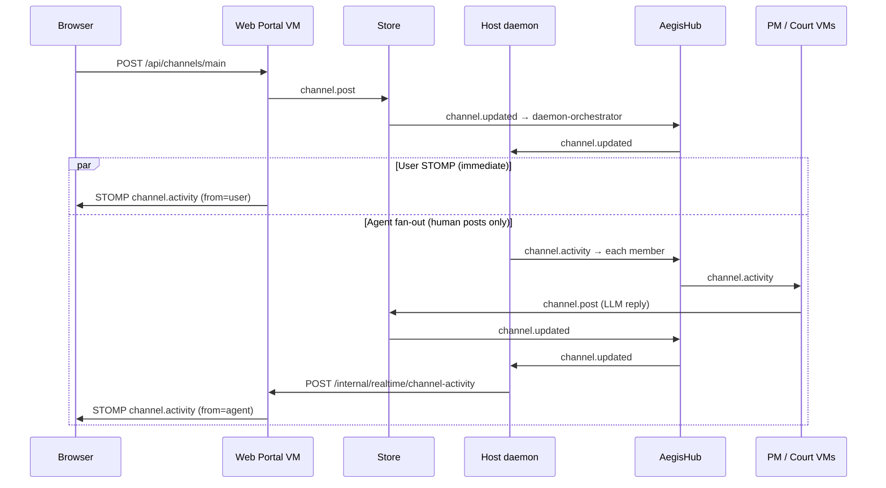

# Channel collaboration debugging

When user messages reach the store but agent replies do not appear in the portal (REST or STOMP), work through the pipeline below.

## Message pipeline



## Common failure points

| Symptom | Likely stage | What to check |
|--------|----------------|---------------|
| User message in UI, no agents | `daemon.fanout.*` | Daemon received `channel.updated`? `from` must be human (`user`, `operator`, etc.). |
| Agents in `aegis channel get` but not UI | `daemon.stomp.notify` / `web-portal.stomp` | Internal notify HTTP 204? `X-Aegis-Channel-Notify` header after microVM rebuild. |
| No agent posts in store | `agent.channel.reply.skip` | LLM via `network-boundary` failing — Ollama down or boundary scopes. |
| Canned "I'm the …" replies | (removed) | Old microVM images; rebuild with `sudo make build-microvms`. |
| Badge shows STOMP but no agent frames | Browser subscription | Topic `/topic/channel.main.activity` subscribed when on channels view. |

## Tracing (`AEGIS_COLLAB_TRACE=1`)

**Recommended (no sudo env needed):**

```bash
sudo ./bin/aegis start --foreground --collab-trace 2>&1 | tee aegis.log
```

The `--collab-trace` flag sets tracing inside the daemon before VMs start. Use this when sudo blocks environment variables (common default).

**Alternative — environment variable** (only if your sudoers allows it):

```bash
export AEGIS_COLLAB_TRACE=1
sudo -E ./bin/aegis start --foreground 2>&1 | tee aegis.log
```

Add `AEGIS_COLLAB_TRACE` to `env_keep` in `scripts/aegisclaw-sudoers.example` for NOPASSWD setups.

**Usually fails:** `sudo AEGIS_COLLAB_TRACE=1 ./bin/aegis start` — many sudo policies reject inline env assignment (`you are not allowed to set the following environment variables`).

On successful start you should see:

```
level=info msg="AEGIS_COLLAB_TRACE=1: channel collaboration tracing enabled ..."
```

Guest VMs (store, court-persona, PM, web-portal) receive `aegis.collab_trace=1` on the kernel cmdline when the daemon was started with `--collab-trace` or the env var. Already-running VMs from a prior start will not trace until you restart the daemon.

```bash
# Terminal 1
sudo ./bin/aegis start --foreground --collab-trace 2>&1 | tee aegis.log

# Terminal 2 — after collab ready
make test-e2e-channel-trace
```

Trace lines look like:

```
[collab-trace][store][channel.post] ch=main from=user
[collab-trace][daemon][fanout.start] ch=main from=user
[collab-trace][court-persona-tester][channel.post.ok] ch=main len=142
[collab-trace][daemon][stomp.notify.ok] ch=main from=court-persona-tester
[collab-trace][web-portal][stomp.publish] ch=main from=court-persona-tester len=142
```

### Where logs land

| Component | Log location |
|-----------|----------------|
| Host daemon + hub | stdout / `aegis.log` — hub `[collab-trace][hub][route]` lines |
| Store / court-persona / PM | **Guest console** — `./bin/aegis vm logs court-persona-ciso` (not in `aegis.log`) |

If you see `fanout.deliver.ok` for all roles but **no** `hub][route] src=court-persona-* dest=store cmd=channel.post`, agents received activity but did not post (usually `llm.call` failed). Check guest logs:

```bash
./bin/aegis vm logs court-persona-ciso | tail -30
./bin/aegis vm logs project-manager-main | tail -30
grep -i 'llm\|channel.reply\|ollama' ~/.aegis/state/fc-court-persona-ciso-console.log 2>/dev/null | tail -20
```

Set a real Ollama model on the host (injected to guests via `aegis.default_model=`):

```bash
AEGIS_DEFAULT_MODEL=llama3.2:3b sudo -E ./bin/aegis start --foreground --collab-trace 2>&1 | tee aegis.log
```

Court personas previously sent `model: "default"` to Ollama (invalid); use a tagged model name from `curl http://127.0.0.1:11434/api/tags`.

Rebuild microVMs after changing store, court-persona, PM, network-boundary, or web-portal:

```bash
sudo make build-microvms
sudo ./bin/aegis stop && sudo ./bin/aegis start --foreground --collab-trace 2>&1 | tee aegis.log
```

## Verification commands

```bash
# Store truth (ground source)
./bin/aegis --json channel get main | jq '.messages[-5:]'

# Portal REST mirror
curl -s http://localhost:8080/api/channels/main | jq '.messages[-5:]'

# Fan-out E2E (store + optional browser)
make test-e2e-portal-channel

# Trace E2E + log summary
bash scripts/verify-channel-collab-trace-e2e.sh

# Live STOMP agent frame (daemon required)
AEGIS_E2E_LIVE_STOMP=1 npx playwright test e2e/portal-channel-stomp-live.spec.js
```

## Agent reply policy (current)

Agents **only** post when the LLM returns real text. Canned `FallbackIntro` strings are no longer auto-posted. Silence usually means `llm.call` failed inside the agent VM — check network-boundary and Ollama, not the portal STOMP layer.
