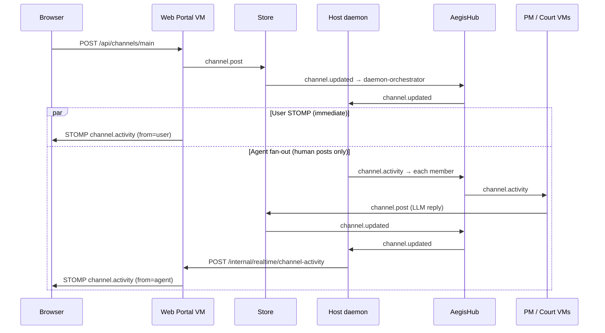

# Channel collaboration debugging

When user messages reach the store but agent replies do not appear in the portal (REST or STOMP), work through the pipeline below.

## Message pipeline



## Common failure points

| Symptom | Likely stage | What to check |
|--------|----------------|---------------|
| User message in UI, no agents | `daemon.fanout.*` | Daemon received `channel.updated`? `from` must be human (`user`, `operator`, etc.). |
| Fan-out ok, zero agent posts in store | `agent.channel.reply` / hubclient | Concurrent `Receive` stealing `llm.call.response` (fixed: process LLM inline on receive thread). Guest logs show `llm.call.response` on main loop without `channel.post.ok`. |
| Agents in `aegis channel get` but not UI | `daemon.stomp.notify` / `web-portal.stomp` | Internal notify HTTP 204? `X-Aegis-Channel-Notify` header after microVM rebuild. |
| No agent posts in store | `agent.channel.reply.skip` | LLM via `network-boundary` failing — Ollama down or boundary scopes. |
| Canned "I'm the …" replies | (removed) | Old microVM images; rebuild with `sudo make build-microvms`. |
| Badge shows STOMP but no agent frames | Browser subscription | Topic `/topic/channel.main.activity` subscribed when on channels view. |

## Debug instrumentation (runtime only)

Troubleshooting hooks are **not** separate binaries. They are cheap no-ops unless enabled at daemon start:

| Env var | Purpose | Guest propagation |
|---------|---------|-------------------|
| `AEGIS_COLLAB_TRACE=1` | `[collab-trace]` pipeline hops (store, hub, daemon, agents, portal) | `aegis.collab_trace=1` on VM cmdline |
| `AEGIS_BOOT_TIMING=1` | `BOOT_TIMING` phases in guest consoles + host metrics | `aegis.boot_timing=1` on VM cmdline |
| `AEGIS_DEBUG=1` | Verbose logrus + startup banner | Host only |

`collab.Tracef(...)` calls in production code always compile in, but `TraceEnabled()` returns false unless the env (or guest cmdline) is set — no log I/O in normal runs.

Functional config (not debug): `--default-model` on `aegis start` sets the Ollama tag for guests when sudo strips env vars.

## Tracing (`AEGIS_COLLAB_TRACE=1`)

Export before start (recommended with sudoers `env_keep`):

```bash
export AEGIS_COLLAB_TRACE=1
export AEGIS_DEFAULT_MODEL=llama3.2:3b   # optional
sudo -E ./bin/aegis start --foreground 2>&1 | tee aegis.log
```

Add `AEGIS_COLLAB_TRACE` to `env_keep` in `scripts/aegisclaw-sudoers.example` for NOPASSWD setups.

**Usually fails:** `sudo AEGIS_COLLAB_TRACE=1 ./bin/aegis start` — many sudo policies reject inline env assignment.

On successful start you should see:

```
level=info msg="AEGIS_COLLAB_TRACE=1: channel collaboration tracing enabled ..."
```

Guest VMs receive `aegis.collab_trace=1` on the kernel cmdline when the host daemon started with the env var. Already-running VMs from a prior start will not trace until you restart the daemon.

Trace lines look like:

```
[collab-trace][store][channel.post] ch=main from=user
[collab-trace][daemon][fanout.start] ch=main from=user
[collab-trace][court-persona-tester][channel.post.ok] ch=main len=142
[collab-trace][daemon][stomp.notify.ok] ch=main from=court-persona-tester
[collab-trace][web-portal][stomp.publish] ch=main from=court-persona-tester len=142
```

### Where logs land

| Component | Log location |
|-----------|----------------|
| Host daemon + hub | stdout / `aegis.log` — hub `[collab-trace][hub][route]` lines |
| Store / court-persona / PM | **Guest console** — `./bin/aegis vm logs court-persona-ciso` (not in `aegis.log`) |

If you see `fanout.deliver.ok` for all roles but **no** `hub][route] src=court-persona-* dest=store cmd=channel.post`, agents received activity but did not post (LLM failure or hubclient race). Check guest logs:

```bash
./bin/aegis vm logs court-persona-ciso | tail -30
./bin/aegis vm logs project-manager-main | tail -30
```

Set a real Ollama model for guest VMs:

```bash
sudo ./bin/aegis start --foreground --default-model llama3.2:3b 2>&1 | tee aegis.log
```

Court personas previously sent `model: "default"` to Ollama (invalid); use a tagged model name from `curl http://127.0.0.1:11434/api/tags`.

Rebuild microVMs after changing store, court-persona, PM, network-boundary, or web-portal:

```bash
sudo make build-microvms
sudo ./bin/aegis stop && sudo ./bin/aegis start --foreground 2>&1 | tee aegis.log
```

## Verification commands

```bash
# Store truth (ground source)
./bin/aegis --json channel get main | jq '.messages[-5:]'

# Portal REST mirror
curl -s http://localhost:8080/api/channels/main | jq '.messages[-5:]'

# Regression: >=2 agent store replies after user post (hubclient race guard)
make test-e2e-channel-replies

# Full fan-out (all 8 agents — slow, LLM may NO_REPLY)
make test-e2e-portal-channel

# Trace E2E + log summary (optional AEGIS_COLLAB_TRACE=1 on daemon)
make test-e2e-channel-trace

# Live STOMP agent frame (daemon required)
AEGIS_E2E_LIVE_STOMP=1 npx playwright test e2e/portal-channel-stomp-live.spec.js
```

## Agent reply policy (current)

Agents **only** post when the LLM returns real text. Canned `FallbackIntro` strings are no longer auto-posted. Silence usually means `llm.call` failed inside the agent VM, the model returned `NO_REPLY`, or (historically) a hubclient decoder race — check network-boundary, Ollama, and guest VM logs.
