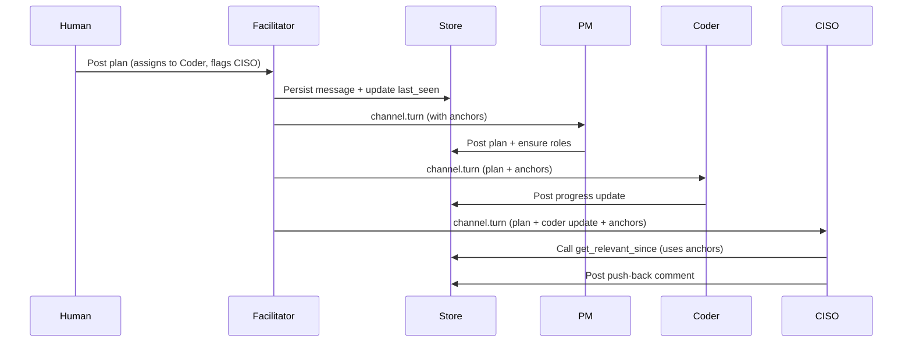

# Turn-Based Message Propagation

**Status**: Authoritative specification (v1)

This document defines how batched turn-based message propagation works in AegisClaw channels. It replaces the previous human-only fan-out model for agents.

## 1. Goals

- Agents receive coherent batches of messages since their own last turn.
- Agents can efficiently determine relevant prior context for the batch.
- LLM usage remains bounded.
- The host daemon stays minimal.
- Full paranoid security model is preserved.

## 2. Core Decisions

- **last_seen_seq** is stored durably in the Store (as part of channel membership state). This ensures durability across facilitator restarts.
- The turn-based system **fully replaces** the old human-only `channel.activity` fan-out path for agents.
- Mention boost policy is **configurable per channel**, with global defaults exposed in the Settings page of the web portal.
- The Channel Facilitator is treated as a logically separate component (even if initially co-located inside the Project Manager binary).
- Humans always receive the **full real-time message stream** via STOMP (important for RAIL model feedback loops).
- Agents have access to a direct `channel.get_messages` tool in addition to the relevance tool, so they can perform their own relevance logic when desired. Agents may store relevance judgments in their own memory between turns.

## 3. Turn Scheduling

- Per-channel round-robin of members.
- Mentioned agents receive a configurable priority boost (default +2 positions, max 2 boosts per full cycle).
- Starvation protection: members whose last turn exceeds a configurable number of cycles are forced forward.
- Human posts are strong triggers for immediate turn consideration.

## 4. Turn Payload

```json
{
  "channel_id": "string",
  "recipient": "string",
  "since_seq": 42,
  "new_messages": [...],
  "relevance_anchors": [38, 39, 41],
  "mention_boosts": {...},
  "generated_at": "..."
}
```

`relevance_anchors` = up to 8 prior message seqs selected via the implicit signals below.

## 5. Relevance Anchors (Implicit Signals)

Computed by the facilitator from the recent window (last 50 messages or 5 minutes):

1. Direct @mentions of the recipient
2. Same author as recent activity in the batch
3. Explicit assignment language
4. Recent PM plan/monitoring posts
5. Topical keyword overlap

No LLM is used for anchor selection.

## 6. Tools Available to Agents

### 6.1 `channel.get_relevant_since`

Primary tool for context reconstruction after receiving a turn.

### 6.2 `channel.get_messages`

Direct fetch tool for when an agent wants to perform its own relevance analysis:

```json
{
  "channel_id": "string",
  "since_seq": number,
  "limit": number,
  "filter": { ... }   // optional keyword / author / etc.
}
```

Agents are expected to persist useful relevance judgments in their own memory component between turns.

## 7. Facilitator Responsibilities

- Maintains round-robin state and per-member `last_seen_seq` (persisted via Store).
- Computes relevance anchors using the signals above.
- Delivers `channel.turn` messages.
- Single actor per channel for concurrency safety.
- Exposes current turn position and `last_seen_seq` values for observability (v1 requirement).

## 8. Observability (v1)

- `last_seen_seq` and current round-robin position per member must be queryable (via CLI and eventually web portal).
- Web portal UI will display turn/round-robin state per channel (to be detailed in web portal spec update).
- Extended `[collab-trace]` instrumentation for turn computation, anchor selection, and tool calls.

## 9. ACLs (to be added)

```yaml
- source: channel-facilitator
  destination: "*"
  commands: [ "channel.turn" ]

- source: agent-*
  destination: store
  commands: [ "channel.get_relevant_since", "channel.get_messages" ]
```

Broad access to the relevance tools by any agent is accepted for v1. This decision should be revisited if abuse or performance issues appear.

## 10. Example Flow (Mermaid)



## 11. Implementation Notes

- `last_seen_seq` is stored in Store (durable).
- Old human-only fan-out path is removed for agents.
- Mention boost values and starvation threshold are per-channel settings.
- Facilitator is a separate logical component.

## 12. Open Items for Later

- Exact UI presentation of round-robin / turn state in web portal (needs web portal spec update).
- Potential tightening of relevance tool ACLs in future.

---

This specification is ready for implementation. All major architectural and policy decisions have been made.