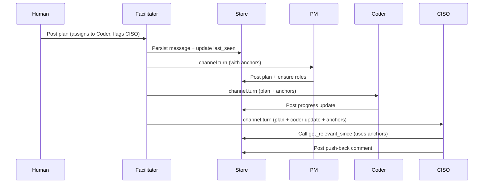

# Turn-Based Message Propagation

**Status**: Authoritative specification (v1)

This document defines how batched turn-based message propagation works in AegisClaw channels. It replaces the previous human-only fan-out model for agents.

## 1. Goals

- Agents receive coherent batches of messages since their own last turn.
- Agents can efficiently determine relevant prior context for the batch.
- LLM usage remains bounded.
- The host daemon stays minimal.
- Full paranoid security model is preserved.

## 2. Core Decisions

- **last_seen_seq** is stored durably in the Store (as part of channel membership state). This ensures durability across facilitator restarts.
- The turn-based system **fully replaces** the old human-only `channel.activity` fan-out path for agents.
- Mention boost policy is **configurable per channel**, with global defaults exposed in the Settings page of the web portal.
- The Channel Facilitator is treated as a logically separate component (even if initially co-located inside the Project Manager binary).
- Humans always receive the **full real-time message stream** via STOMP (important for RAIL model feedback loops).
- Agents have access to a direct `channel.get_messages` tool in addition to the relevance tool, so they can perform their own relevance logic when desired. Agents may store relevance judgments in their own memory between turns.

## 3. Turn Scheduling

- Per-channel round-robin of members.
- Mentioned agents receive a configurable priority boost (default +2 positions, max 2 boosts per full cycle).
- Starvation protection: members whose last turn exceeds a configurable number of cycles are forced forward.
- Human posts are strong triggers for immediate turn consideration.

## 4. Turn Payload

```json
{
  "channel_id": "string",
  "recipient": "string",
  "since_seq": 42,
  "new_messages": [...],
  "relevance_anchors": [38, 39, 41],
  "mention_boosts": {...},
  "generated_at": "..."
}
```

`relevance_anchors` = up to 8 prior message seqs selected via the implicit signals below.

## 5. Relevance Anchors (Implicit Signals)

Computed by the facilitator from the recent window (last 50 messages or 5 minutes):

1. Direct @mentions of the recipient
2. Same author as recent activity in the batch
3. Explicit assignment language
4. Recent PM plan/monitoring posts
5. Topical keyword overlap

No LLM is used for anchor selection.

## 6. Tools Available to Agents

### 6.1 `channel.get_relevant_since`

Primary tool for context reconstruction after receiving a turn.

### 6.2 `channel.get_messages`

Direct fetch tool for when an agent wants to perform its own relevance analysis:

```json
{
  "channel_id": "string",
  "since_seq": number,
  "limit": number,
  "filter": { ... }   // optional keyword / author / etc.
}
```

Agents are expected to persist useful relevance judgments in their own memory component between turns.

## 7. Facilitator Responsibilities

- Maintains round-robin state and per-member `last_seen_seq` (persisted via Store).
- Computes relevance anchors using the signals above.
- Delivers `channel.turn` messages.
- Single actor per channel for concurrency safety.
- Exposes current turn position and `last_seen_seq` values for observability (v1 requirement).

## 8. Observability and User Feedback (v1)

A key goal of this feature is to avoid the situation where a user posts a plan, roles are assigned work, and the user has no visibility into what is happening (or failing). Observability must be designed in from the start.

### 8.1 Per-Agent Activity View (Agents Page)

The web portal `#agents` page (and equivalent dashboard views) **must** expose useful state for each running agent/role participating in channels. At minimum, the following should be visible:

- Last turn received (sequence number + timestamp)
- `cycles_since_turn`
- Current status (e.g. Idle, Processing turn, Error)
- Last known outcome (Success / NO_REPLY / Error)
- Whether a turn is currently pending
- Last activity timestamp

**Future expansion** (not required in v1 but the data model should support it):
- Token usage and model invocations
- Model(s) used for recent turns
- History of recent turns / state transitions

This view is the primary way users will understand what their agents are doing.

### 8.2 Channel-Level Status Feedback

Channels should provide lightweight, default-visible feedback so users do not have to dig into CLI tools or separate pages.

- A **single line of current status** should be maintained and updated in the channel as turns are assigned and progress.
- On **actual errors or failures** during turn delivery or processing (e.g. delivery failure after retries, permission/serialization errors, role not ready), a visible error note should be posted to the channel. This note may link to the relevant agent's view for more detail.

**Important distinction**:
- `NO_REPLY` is an intentional agent decision and is **not** treated as an error.
- Only genuine failures (where the system or agent attempted something but could not complete it) should surface as errors.

### 8.3 CLI Support

The existing `aegis channel turn-state` command should be improved alongside the web UI changes to remain a useful power-user and debugging tool. It should clearly expose per-member turn state, including `last_seen_seq`, `cycles_since_turn`, boost status, and recent outcomes.

### 8.4 Error vs Non-Error Semantics

- **Non-error**: Agent receives a turn and deliberately returns `NO_REPLY` or stays silent.
- **Error**: Turn delivery fails, the agent encounters a runtime error while processing, or the system cannot complete an action it attempted on behalf of the agent.

Errors should be visible both in channel notes (when appropriate) and in the agent's activity view.

## 9. ACLs (to be added)

```yaml
- source: channel-facilitator
  destination: "*"
  commands: [ "channel.turn" ]

- source: agent-*
  destination: store
  commands: [ "channel.get_relevant_since", "channel.get_messages" ]
```

Broad access to the relevance tools by any agent is accepted for v1. This decision should be revisited if abuse or performance issues appear.

## 10. Example Flow (Mermaid)



## 11. Implementation Notes

- `last_seen_seq` is stored in Store (durable).
- Old human-only fan-out path is removed for agents.
- Mention boost values and starvation threshold are per-channel settings.
- Facilitator is a separate logical component.
- Observability data (last turn, cycles, outcomes) must be exposed via both CLI and web portal.

## 12. Open Items for Later

- Exact UI presentation and layout of per-agent activity on the `#agents` page (to be detailed in web portal spec).
- Richer agent lifecycle observability (token usage, model history, full state transitions) on the Agents page.
- Potential tightening of relevance tool ACLs in future.
- Whether channel status notes should be configurable or always-on.

---

This specification is ready for implementation. All major architectural and policy decisions have been made.