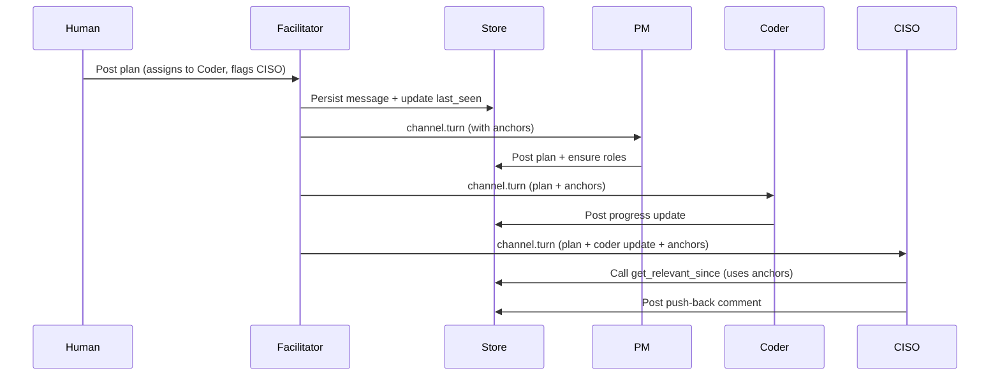

# Turn-Based Message Propagation

**Status**: Authoritative specification (v1)

This document defines how batched turn-based message propagation works in AegisClaw channels. It replaces the previous human-only fan-out model for agents.

## 1. Goals

- Agents receive coherent batches of messages since their own last turn.
- Agents can efficiently determine relevant prior context for the batch.
- LLM usage remains bounded.
- The host daemon stays minimal.
- Full paranoid security model is preserved.
- Users have reasonable visibility when roles are assigned work and when issues occur.

## 2. Core Decisions

- **last_seen_seq** is stored durably in the Store (as part of channel membership state).
- The turn-based system **fully replaces** the old human-only `channel.activity` fan-out path for agents.
- Mention boost policy is **configurable per channel**, with global defaults exposed in the Settings page of the web portal.
- The Channel Facilitator is treated as a logically separate component (even if initially co-located).
- Humans always receive the **full real-time message stream** via STOMP.
- Agents have access to `channel.get_messages` in addition to the relevance tool.

## 3. Turn Scheduling and Delivery

The scheduling model combines round-robin fairness with stronger responsiveness to explicit mentions, while supporting delivery to multiple relevant roles when appropriate.

### 3.1 Base Mechanism

- Per-channel round-robin of current members using `last_seen_seq` and `cycles_since_turn`.
- Human posts are strong triggers for immediate scheduling consideration.
- Mention boosts are configurable (default +2 positions, max 2 boosts per full cycle).
- Starvation protection exists for members with high `cycles_since_turn`.

### 3.2 Mention Handling and Fairness

When a post explicitly mentions roles (e.g. `@Coder`, `@Tester`), those roles receive stronger promotion than the default boost.

After periods of high mention activity (e.g. a detailed PM plan), the scheduler performs a **fairness / catch-up pass**: agents that have not yet received a turn since the last significant human post are given priority before agents who have already received recent turns. This balances responsiveness to assignments with the principle that every agent should have a reasonable chance to contribute.

### 3.3 Multi-Recipient Delivery

A single post may result in turns being delivered to multiple relevant recipients when the post clearly targets several roles (common with PM plans and broadcasts). The facilitator determines the set of recipients based on mentions, role relevance, and current scheduling state.

### 3.4 Delivery and Resilience

- The facilitator attempts to deliver `channel.turn` messages to selected recipients.
- Successful delivery updates the recipient’s `last_seen_seq`.
- If delivery fails after retries (role not ready, timeout, transient error), the failure is recorded in turn state and treated as a visible error (see Observability section).
- `NO_REPLY` from an agent after receiving a turn is **not** treated as a delivery error.

## 4. Turn Payload

```json
{
  "channel_id": "string",
  "recipient": "string",
  "since_seq": 42,
  "new_messages": [...],
  "relevance_anchors": [38, 39, 41],
  "mention_boosts": {...},
  "generated_at": "..."
}
```

`relevance_anchors` = up to 8 prior message seqs selected via the implicit signals below.

## 5. Relevance Anchors (Implicit Signals)

Computed by the facilitator from the recent window (last 50 messages or 5 minutes):

1. Direct @mentions of the recipient
2. Same author as recent activity in the batch
3. Explicit assignment language
4. Recent PM plan/monitoring posts
5. Topical keyword overlap

No LLM is used for anchor selection.

## 6. Tools Available to Agents

### 6.1 `channel.get_relevant_since`
Primary tool for context reconstruction after receiving a turn.

### 6.2 `channel.get_messages`
Direct fetch tool for when an agent wants to perform its own relevance analysis. Agents may persist relevance judgments in their own memory between turns.

## 7. Facilitator Responsibilities

The Channel Facilitator is the owner of turn-based collaboration orchestration. Its responsibilities include:

- Maintaining per-channel round-robin state and `last_seen_seq` (persisted via Store).
- Applying mention boosts and performing fairness / catch-up passes.
- Computing relevance anchors using cheap implicit signals.
- Deciding which roles receive turns (including multi-recipient decisions).
- Delivering `channel.turn` messages and handling delivery resilience.
- Recording outcomes and surfacing basic errors/status when delivery or processing fails.
- Exposing current turn position and per-member state for observability.

The facilitator does **not** decide what an agent should do with a turn, nor does it perform LLM calls or response generation.

## 8. Observability and User Feedback (v1)

A key goal of this feature is to avoid users posting plans and receiving no visibility when roles are assigned work or when issues occur.

### 8.1 Per-Agent Activity View (Agents Page)

The `#agents` page must expose useful state for each running agent/role:
- Last turn received (seq + timestamp)
- `cycles_since_turn`
- Current status
- Last known outcome (Success / NO_REPLY / Error)
- Whether a turn is currently pending
- Last activity timestamp

Future expansion (data model should support): token usage, model invocations, and richer state history.

### 8.2 Channel-Level Status Feedback

- A single line of current status is maintained and updated in the channel.
- On actual errors or failures during turn delivery or processing, a visible error note is posted to the channel (may link to the agent’s view).
- `NO_REPLY` is an intentional agent decision and is **not** surfaced as an error.

### 8.3 CLI Support

`aegis channel turn-state` is improved to clearly show per-member state, recent outcomes, and boost/fairness status.

### 8.4 Error Semantics

- **Non-error**: Agent receives a turn and returns `NO_REPLY` or stays silent.
- **Error**: Repeated delivery failure, processing error, or system inability to complete an action it attempted.

## 9. ACLs

```yaml
- source: channel-facilitator
  destination: "*"
  commands: [ "channel.turn" ]

- source: agent-*
  destination: store
  commands: [ "channel.get_relevant_since", "channel.get_messages" ]
```

## 10. Example Flow (Mermaid)



## 11. Implementation Notes

- `last_seen_seq` is stored in Store (durable).
- Old human-only fan-out path is removed for agents.
- Scheduling includes mention boosting + fairness/catch-up passes and multi-recipient delivery.
- Facilitator owns scheduling, delivery, and basic error surfacing.
- Observability data must be exposed via both CLI and web portal.

## 12. Open Items for Later

- Exact UI layout of per-agent activity on the `#agents` page.
- Richer agent lifecycle observability (tokens, models, invocation history).
- Tuning of fairness/catch-up thresholds and mention boost behavior.
- Whether channel status notes should be configurable.

---

This specification is ready for implementation. All major architectural and policy decisions have been made.